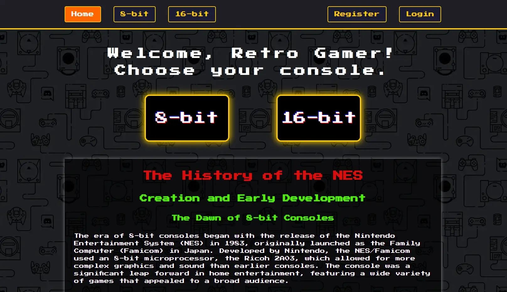
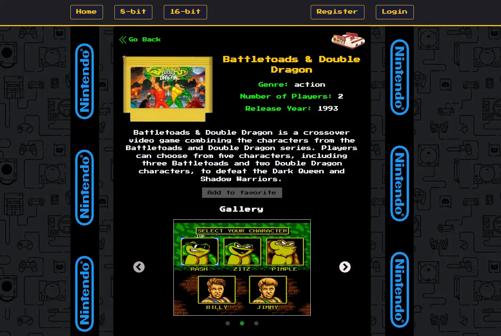

# Retro Games Frontend

Welcome to the frontend of the Retro Games application! This project is a
full-stack application designed to bring back the nostalgia of 90s retro games.
The frontend is built using React with Create React App, and it connects to a
backend built with Express, MongoDB, and various file storage services.

## Project Overview

Retro Games allows users to relive the classic gaming experience by providing
access to retro games from Nintendo and Sega consoles. The app includes detailed
information about each game, screenshots, cheats, and even the ability to play
games directly in the browser using an integrated emulator.

#### Home Page

#### Games

## Features

- **User Registration & Authentication**: Users can sign up, log in, and manage
  their favorite games.
- **Console Information**: Detailed descriptions of 8-bit Nintendo and 16-bit
  Sega consoles.
- **Game Details**: Each game has a dedicated page with a gallery of
  screenshots, cheats, and tips.
- **Built-in Emulator**: Play retro games directly in your browser using
  NeptunJS.
- **Favorites Management**: Registered users can add or remove games from their
  favorites list.
- **Game Search & Filter**: Quickly find your favorite games using a responsive
  search filter.
- **Responsive Design**: Optimized for mobile devices, tablets, and desktops.
- **State Management**: Global and server state managed with Redux.

- **Data Persistence**: JWT tokens are persisted for a seamless user experience.

- **Route Management**: Public and private routes are configured to control page
  access.
- **Performance Optimization**: Code splitting and lazy loading enhance the
  app's performance.
- **User Notifications**: Users receive notifications for various actions,
  improving their experience.

## Pages

- **Home Page**: Detailed information about 8-bit Nintendo and 16-bit Sega
  consoles.

- **EightBitGamesPage**: A list of 8-bit games.

- **SixteenBitGamesPage**: A list of 16-bit games.

- **ProfilePage**: Manage your favorite games.

- **RegisterPage**: User registration.

- **LoginPage**: User login.

- **GameDetailsPage**: Detailed game information, including emulator and
  gallery.

- **NotFoundPage**: A custom 404 page for non-existent routes.

### Technologies Used

- React: UI development.
- React Router: Routing.
- Redux: State management.
- Redux Persist: Data persistence.
- Lodash: Utility functions.
- NeptunJS: Game emulation.
- Firebase Storage: Game storage.
- Dropbox: Image storage.
- CSS Modules: Component-specific styling.
- Create React App: Project setup and configuration.
- Express: Backend framework.
- MongoDB: Database.
- Axios: HTTP client.

### Acknowledgments

- **NeptunJS Developers**: For providing the emulator that powers our in-browser
  gameplay.

- **OpenAI's ChatGPT**: For assisting in the development of this project by
  providing valuable guidance and code suggestions.
